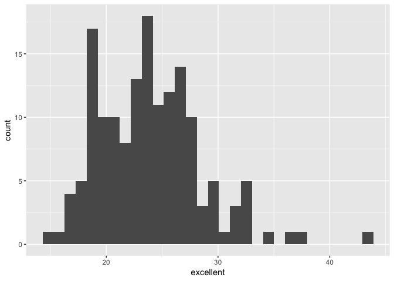
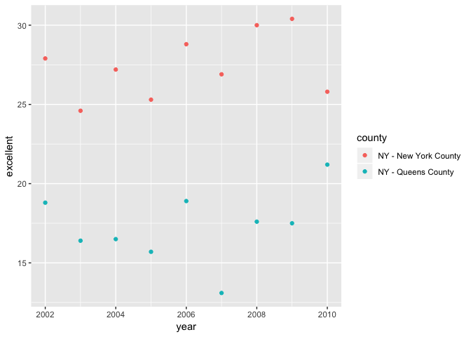

p8105\_hw2\_jv2629
================
Jaclyn Verity - jv2629
September 25, 2018

Problem 1
=========

NYC Transit Data
----------------

**Read in and select desired variables.**

``` r
NYC_data = read_csv("./data/NYC_Transit_Subway_Entrance_And_Exit_Data.csv",
  col_types = cols_only(
    `Line` = col_character(),
    `Station Name` = col_character(),
    `Station Latitude` = col_double(),
    `Station Longitude` = col_double(),
    `Route1` = col_factor(NULL),
    `Route2` = col_factor(NULL),
    `Route3` = col_factor(NULL),
    `Route4` = col_factor(NULL),
    `Route5` = col_factor(NULL),
    `Route6` = col_factor(NULL),
    `Route7` = col_factor(NULL),
    `Route8` = col_factor(NULL),
    `Route9` = col_factor(NULL),
    `Route10` = col_factor(NULL),
    `Route11` = col_factor(NULL),
    `Entry` = col_factor(NULL),
    `Entrance Type` = col_factor(NULL),
    `Vending` = col_factor(NULL),
    `ADA` = col_logical()
  ))
```

Clean NYC Data
--------------

``` r
NYC_data = NYC_data %>% 
  janitor::clean_names() 
```

**Recoding entry variable.**

``` r
recode_factor(NYC_data[["entry"]], YES = TRUE, NO = FALSE, .default = NULL)
```

This data set, entitled NYC\_data, contains information on NYC Metro Stations entrances and exits, including: name, location, type of entrance, if entrance is permited, whether a metro card could be purchased, and if the station is accessible by persons with disabilities. To render this data set I read it into my R Markdown document while simultaneoulsy restricting the data to the variables of interest and assigning their variable type. The resulting data contains 1,868 rows and 19 columns of data. These data are tidy because there are no categorizations that are columns.

Manipulating Data
-----------------

**Creating a data set that consists of only the NYC stations, not all entrances and exits.**

``` r
NYC_stations = distinct(NYC_data, line, station_name, .keep_all =  TRUE)

NYC_stations
```

    ## # A tibble: 465 x 19
    ##    line  station_name station_latitude station_longitu… route1 route2
    ##    <chr> <chr>                   <dbl>            <dbl> <fct>  <fct> 
    ##  1 4 Av… 25th St                  40.7            -74.0 R      <NA>  
    ##  2 4 Av… 36th St                  40.7            -74.0 N      R     
    ##  3 4 Av… 45th St                  40.6            -74.0 R      <NA>  
    ##  4 4 Av… 53rd St                  40.6            -74.0 R      <NA>  
    ##  5 4 Av… 59th St                  40.6            -74.0 N      R     
    ##  6 4 Av… 77th St                  40.6            -74.0 R      <NA>  
    ##  7 4 Av… 86th St                  40.6            -74.0 R      <NA>  
    ##  8 4 Av… 95th St                  40.6            -74.0 R      <NA>  
    ##  9 4 Av… 9th St                   40.7            -74.0 F      G     
    ## 10 4 Av… Atlantic Av…             40.7            -74.0 B      Q     
    ## # ... with 455 more rows, and 13 more variables: route3 <fct>,
    ## #   route4 <fct>, route5 <fct>, route6 <fct>, route7 <fct>, route8 <fct>,
    ## #   route9 <fct>, route10 <fct>, route11 <fct>, entrance_type <fct>,
    ## #   entry <fct>, vending <fct>, ada <lgl>

There are 465 unique metro stations in this data set.

**Creating a data set for ADA compliance.**

``` r
NYC_ada = filter(NYC_stations, ada == TRUE)

NYC_ada
```

    ## # A tibble: 84 x 19
    ##    line  station_name station_latitude station_longitu… route1 route2
    ##    <chr> <chr>                   <dbl>            <dbl> <fct>  <fct> 
    ##  1 4 Av… Atlantic Av…             40.7            -74.0 B      Q     
    ##  2 4 Av… DeKalb Av                40.7            -74.0 B      Q     
    ##  3 4 Av… Pacific St               40.7            -74.0 B      Q     
    ##  4 42nd… Grand Centr…             40.8            -74.0 GS     4     
    ##  5 6 Av… 34th St                  40.7            -74.0 B      D     
    ##  6 6 Av… 47-50th Sts…             40.8            -74.0 B      D     
    ##  7 6 Av… Church Av                40.6            -74.0 F      <NA>  
    ##  8 63rd… 21st St                  40.8            -73.9 F      <NA>  
    ##  9 63rd… Lexington Av             40.8            -74.0 F      <NA>  
    ## 10 63rd… Roosevelt I…             40.8            -74.0 F      <NA>  
    ## # ... with 74 more rows, and 13 more variables: route3 <fct>,
    ## #   route4 <fct>, route5 <fct>, route6 <fct>, route7 <fct>, route8 <fct>,
    ## #   route9 <fct>, route10 <fct>, route11 <fct>, entrance_type <fct>,
    ## #   entry <fct>, vending <fct>, ada <lgl>

There are 84 metro stations in this data set that are ADA compliant.

**Creating a data set that filters through vending and allowing entry.**

``` r
NYC_vending = NYC_data %>% 
  filter(vending == "NO")

NYC_entry = NYC_vending %>% 
  filter(entry == "YES")

NYC_vending
```

    ## # A tibble: 183 x 19
    ##    line  station_name station_latitude station_longitu… route1 route2
    ##    <chr> <chr>                   <dbl>            <dbl> <fct>  <fct> 
    ##  1 4 Av… 53rd St                  40.6            -74.0 R      <NA>  
    ##  2 4 Av… 77th St                  40.6            -74.0 R      <NA>  
    ##  3 4 Av… 9th St                   40.7            -74.0 F      G     
    ##  4 4 Av… Bay Ridge Av             40.6            -74.0 R      <NA>  
    ##  5 42nd… Grand Centr…             40.8            -74.0 GS     4     
    ##  6 42nd… Grand Centr…             40.8            -74.0 GS     4     
    ##  7 6 Av… 7th Av                   40.7            -74.0 F      <NA>  
    ##  8 6 Av… 7th Av                   40.7            -74.0 F      <NA>  
    ##  9 6 Av… 7th Av                   40.7            -74.0 F      <NA>  
    ## 10 6 Av… 7th Av                   40.7            -74.0 F      <NA>  
    ## # ... with 173 more rows, and 13 more variables: route3 <fct>,
    ## #   route4 <fct>, route5 <fct>, route6 <fct>, route7 <fct>, route8 <fct>,
    ## #   route9 <fct>, route10 <fct>, route11 <fct>, entrance_type <fct>,
    ## #   entry <fct>, vending <fct>, ada <lgl>

``` r
NYC_entry
```

    ## # A tibble: 69 x 19
    ##    line  station_name station_latitude station_longitu… route1 route2
    ##    <chr> <chr>                   <dbl>            <dbl> <fct>  <fct> 
    ##  1 4 Av… 9th St                   40.7            -74.0 F      G     
    ##  2 6 Av… 7th Av                   40.7            -74.0 F      <NA>  
    ##  3 6 Av… 7th Av                   40.7            -74.0 F      <NA>  
    ##  4 6 Av… 7th Av                   40.7            -74.0 F      <NA>  
    ##  5 6 Av… 7th Av                   40.7            -74.0 F      <NA>  
    ##  6 6 Av… 7th Av                   40.7            -74.0 F      <NA>  
    ##  7 6 Av… 7th Av                   40.7            -74.0 F      <NA>  
    ##  8 6 Av… 7th Av                   40.7            -74.0 F      <NA>  
    ##  9 6 Av… 7th Av                   40.7            -74.0 F      <NA>  
    ## 10 6 Av… Bergen St                40.7            -74.0 F      G     
    ## # ... with 59 more rows, and 13 more variables: route3 <fct>,
    ## #   route4 <fct>, route5 <fct>, route6 <fct>, route7 <fct>, route8 <fct>,
    ## #   route9 <fct>, route10 <fct>, route11 <fct>, entrance_type <fct>,
    ## #   entry <fct>, vending <fct>, ada <lgl>

In NYC, 0.3770492 metro entrances/exits without vending allow entry.

**Creating a data set that rearranges how routes are displayed.**

``` r
NYC_route = gather(NYC_stations, key = route_number, value = route_name, route1:route11) 
```

    ## Warning: attributes are not identical across measure variables;
    ## they will be dropped

``` r
NYC_route
```

    ## # A tibble: 5,115 x 10
    ##    line  station_name station_latitude station_longitu… entrance_type entry
    ##    <chr> <chr>                   <dbl>            <dbl> <fct>         <fct>
    ##  1 4 Av… 25th St                  40.7            -74.0 Stair         YES  
    ##  2 4 Av… 36th St                  40.7            -74.0 Stair         YES  
    ##  3 4 Av… 45th St                  40.6            -74.0 Stair         YES  
    ##  4 4 Av… 53rd St                  40.6            -74.0 Stair         YES  
    ##  5 4 Av… 59th St                  40.6            -74.0 Stair         YES  
    ##  6 4 Av… 77th St                  40.6            -74.0 Stair         YES  
    ##  7 4 Av… 86th St                  40.6            -74.0 Stair         YES  
    ##  8 4 Av… 95th St                  40.6            -74.0 Stair         YES  
    ##  9 4 Av… 9th St                   40.7            -74.0 Stair         YES  
    ## 10 4 Av… Atlantic Av…             40.7            -74.0 Elevator      YES  
    ## # ... with 5,105 more rows, and 4 more variables: vending <fct>,
    ## #   ada <lgl>, route_number <chr>, route_name <chr>

``` r
filter(NYC_route, route_name == "A")
```

    ## # A tibble: 60 x 10
    ##    line  station_name station_latitude station_longitu… entrance_type entry
    ##    <chr> <chr>                   <dbl>            <dbl> <fct>         <fct>
    ##  1 42nd… Times Square             40.8            -74.0 Stair         YES  
    ##  2 8 Av… 125th St                 40.8            -74.0 Stair         YES  
    ##  3 8 Av… 145th St                 40.8            -73.9 Stair         YES  
    ##  4 8 Av… 14th St                  40.7            -74.0 Easement      YES  
    ##  5 8 Av… 168th St - …             40.8            -73.9 Stair         YES  
    ##  6 8 Av… 175th St                 40.8            -73.9 Elevator      YES  
    ##  7 8 Av… 181st St                 40.9            -73.9 Door          YES  
    ##  8 8 Av… 190th St                 40.9            -73.9 Door          YES  
    ##  9 8 Av… 34th St                  40.8            -74.0 Elevator      YES  
    ## 10 8 Av… 42nd St                  40.8            -74.0 Easement      YES  
    ## # ... with 50 more rows, and 4 more variables: vending <fct>, ada <lgl>,
    ## #   route_number <chr>, route_name <chr>

``` r
filter(NYC_route, route_name == "A", ada == "TRUE")
```

    ## # A tibble: 17 x 10
    ##    line  station_name station_latitude station_longitu… entrance_type entry
    ##    <chr> <chr>                   <dbl>            <dbl> <fct>         <fct>
    ##  1 8 Av… 14th St                  40.7            -74.0 Easement      YES  
    ##  2 8 Av… 168th St - …             40.8            -73.9 Stair         YES  
    ##  3 8 Av… 175th St                 40.8            -73.9 Elevator      YES  
    ##  4 8 Av… 34th St                  40.8            -74.0 Elevator      YES  
    ##  5 8 Av… 42nd St                  40.8            -74.0 Easement      YES  
    ##  6 8 Av… 59th St                  40.8            -74.0 Easement      YES  
    ##  7 8 Av… Inwood - 20…             40.9            -73.9 Elevator      YES  
    ##  8 8 Av… West 4th St              40.7            -74.0 Elevator      YES  
    ##  9 8 Av… World Trade…             40.7            -74.0 Stair         YES  
    ## 10 Broa… Times Squar…             40.8            -74.0 Stair         YES  
    ## 11 Broa… 59th St-Col…             40.8            -74.0 Stair         YES  
    ## 12 Broa… Times Square             40.8            -74.0 Easement      YES  
    ## 13 Cana… 8th Av                   40.7            -74.0 Stair         YES  
    ## 14 Fran… Franklin Av              40.7            -74.0 Door          YES  
    ## 15 Fult… Euclid Av                40.7            -73.9 Elevator      YES  
    ## 16 Fult… Franklin Av              40.7            -74.0 Stair         YES  
    ## 17 Rock… Howard Beach             40.7            -73.8 Elevator      YES  
    ## # ... with 4 more variables: vending <fct>, ada <lgl>, route_number <chr>,
    ## #   route_name <chr>

In NYC, 60 stations serve the A train, of which 17 are ADA compliant.

Problem 2
=========

**Reading in and cleaning the Mr. Trash Wheel data sheet**

``` r
library(readxl)
mr_trash = 
  read_excel("./data/HealthyHarborWaterWheelTotals2018-7-28.xlsx", sheet = "Mr. Trash Wheel", range = "A2:N256", col_names = TRUE) %>% 
  janitor::clean_names() %>% 
  mutate(round(sports_balls)) %>% 
  mutate(sports_balls =  as.integer(sports_balls)) %>% 
  filter(dumpster != "NA")
```

**Read and clean precipitation 2016 and 2017**

``` r
precip_16 = 
  read_excel("./data/HealthyHarborWaterWheelTotals2018-7-28.xlsx", sheet = "2016 Precipitation", range = "A2:B14", col_names = TRUE) %>% 
  mutate(year = "2016")

precip_17 =
  read_excel("./data/HealthyHarborWaterWheelTotals2018-7-28.xlsx", sheet = "2017 Precipitation", range = "A2:B14", col_names = TRUE) %>% 
  mutate(year = "2017")

precip_total =
  bind_rows(precip_16, precip_17) %>% 
  janitor::clean_names() %>% 
  mutate(month = month.name[month])

mr_trash16 = mr_trash %>% 
  filter(year == 2016)
```

The Mr. Trash Wheel data set contains information on the dumpsters and what they are collecting in the Baltimore Harbor. It includes information on the month and day the dumpster was evaluated, the weight and volume of trash collected, and different common categories of trash. It contains 215 observations and a total of 15 variables.

The precipitation data set contains total precipitation in inches for each month in 2016 and 2017. It contains 24 observations and 3 variables.

The total precipitation for 2017 is 32.93. The median number of sports balls in a dumpster in 2016 is 26.

Problem 3
=========

**Loading the BRFSS data and initial clean**

``` r
# install.packages("devtools")
devtools::install_github("p8105/p8105.datasets")
```

    ## Skipping install of 'p8105.datasets' from a github remote, the SHA1 (21f5ad1c) has not changed since last install.
    ##   Use `force = TRUE` to force installation

``` r
library(p8105.datasets)

beh_risk = brfss_smart2010 %>% 
  janitor::clean_names() %>% 
  filter(topic == "Overall Health") %>% 
  select(-class, -topic, -question, -sample_size, -(confidence_limit_low:geo_location)) %>% 
 rename(state = locationabbr, county = locationdesc)
```

**Taking base data set and manipulating it for analysis**

``` r
beh_risk = beh_risk %>% 
  spread(key = response, value = data_value) %>% 
  janitor::clean_names() %>% 
  mutate(prop_excel_v_good = (excellent + very_good)/100)
```

**Code to answer specific questions**

State and location information in data set...

``` r
unique_locations = beh_risk %>% 
  distinct(county) %>% 
  nrow()

unique_states = beh_risk %>% 
  distinct(state)

beh_risk %>% 
  count(state) %>% 
  arrange(desc(n))
```

    ## # A tibble: 51 x 2
    ##    state     n
    ##    <chr> <int>
    ##  1 NJ      146
    ##  2 FL      122
    ##  3 NC      115
    ##  4 WA       97
    ##  5 MD       90
    ##  6 MA       79
    ##  7 TX       71
    ##  8 NY       65
    ##  9 SC       63
    ## 10 CO       59
    ## # ... with 41 more rows

There are 404 unique locations in the data set. Every state and DC are represented in the data set. The state that is observed the most is New Jersey, with 146 observations.

\*\*Response information...

``` r
excellent_response = beh_risk %>% 
  filter(year == 2002) %>% 
  pull(excellent) %>% 
  median(na.rm = TRUE)

excellent_df = beh_risk %>% 
  filter(year == 2002)

ggplot(excellent_df, aes(x = excellent)) + 
  geom_histogram()
```

    ## `stat_bin()` using `bins = 30`. Pick better value with `binwidth`.

    ## Warning: Removed 2 rows containing non-finite values (stat_bin).



``` r
excellent_scatter = beh_risk %>% 
  filter(county == "NY - New York County" | county == "NY - Queens County")

ggplot(excellent_scatter, aes(x = year, y = excellent)) + 
  geom_point(aes(color = county))
```



The median of the Excellent response value is 23.6.
